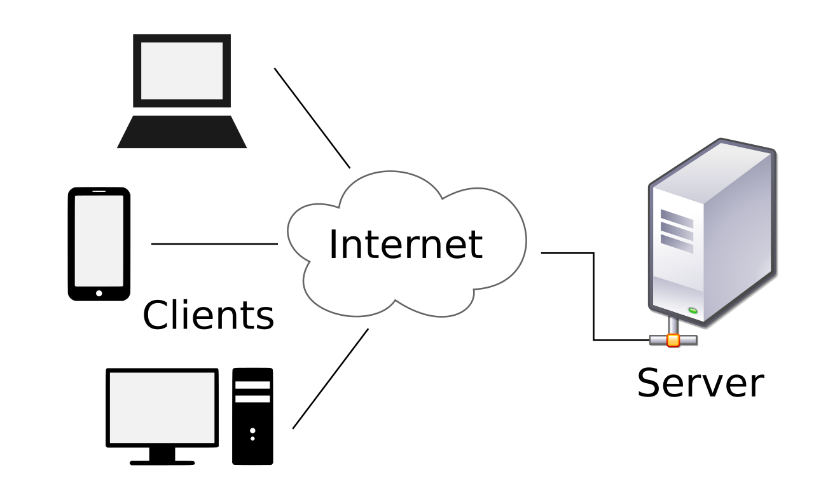
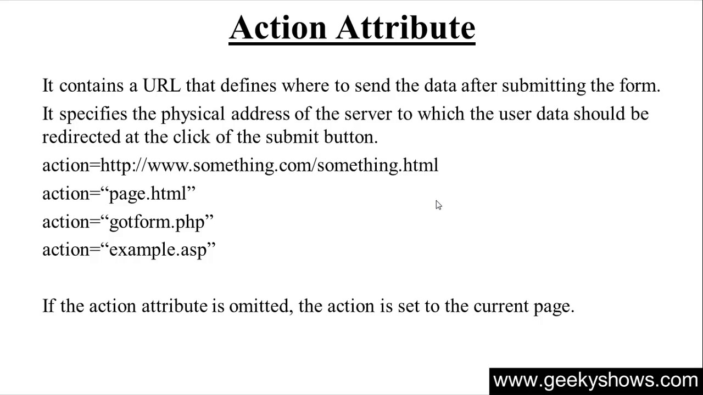

# Send From Data

 

 * The web runs on a client/server architecture, which can be summarized as follows. The HTTP protocol is used by a client to send a message to a server. The same protocol is used by the server to respond to the message.

 * A web page's HTML type is nothing more than a user-friendly way to set up an HTTP request to transfer data to a server. This requires the user to include details that would be used in the HTTP search.

 * On the client side, you'll need to find out how to send the info. The variable determines the format in which the data will be sent. Its attributes are all designed to allow you to modify the request that is submitted when a user clicks the submit button. Action and process are the two most important characteristics.

 * The action attribute is used to explain how something is done. Where the data is sent is calculated by the action attribute. It must have a legitimate relative or absolute URL as its value. If this attribute isn't defined, the data would be submitted to the current page's URL, which is the URL of the page that includes the form.

 

  
 
## The GET method
 is used by the browser to order a resource from the server: "Hey server, I'd like to get this resource." The browser sends an empty body in this situation. When a form is transmitted using this process, the data sent to the server is appended to the URL since the body is null.

  

## The POST method
 is a bit more complex. It's the process by which the browser connects with the server as it demands a response that takes into account the data given in the HTTP request body: "Hey server, look at this data and give me back an acceptable answer." When this approach is used to submit a form, the data is appended to the body of the HTTP message.